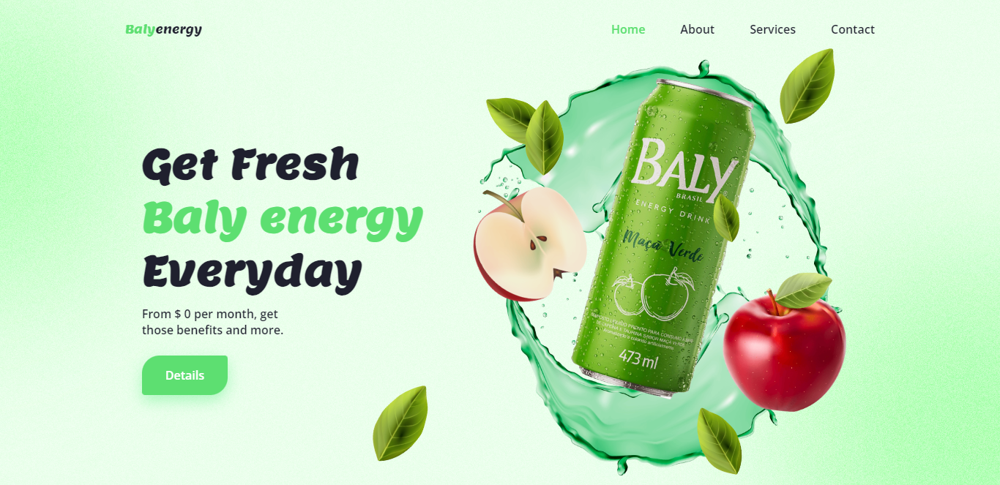

# Responsive-Baly-energy-website

🍎

https://thesko27.github.io/Responsive-Baly-energy-website/git

-   Responsive design of the Baly energy website using HTML, CSS and JavaScript
-   Contains CSS and GSAP animations.
-   Developed first with the Mobile First methodology, then for desktop.
-   Compatible with all mobile devices and with beautiful and nice user interface.

💙
